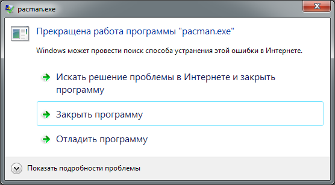
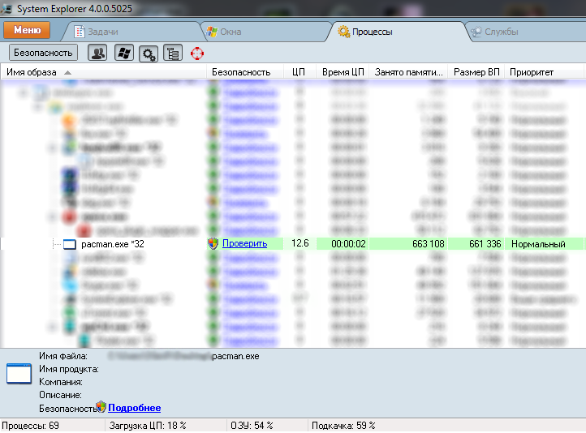
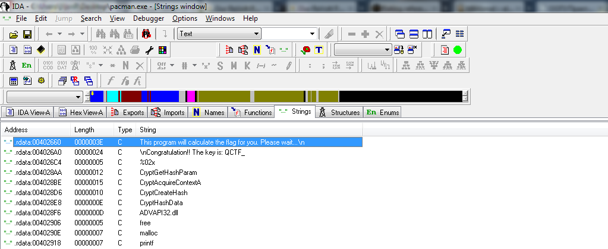
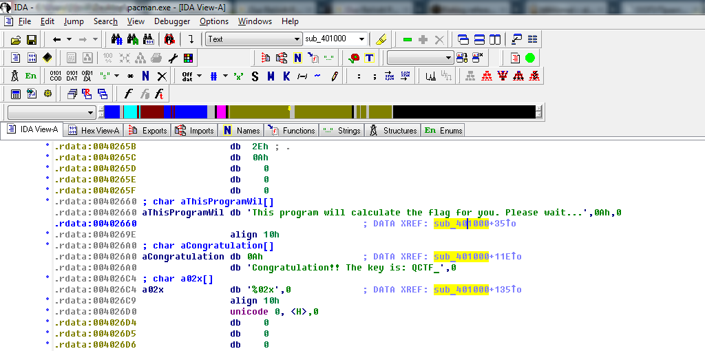
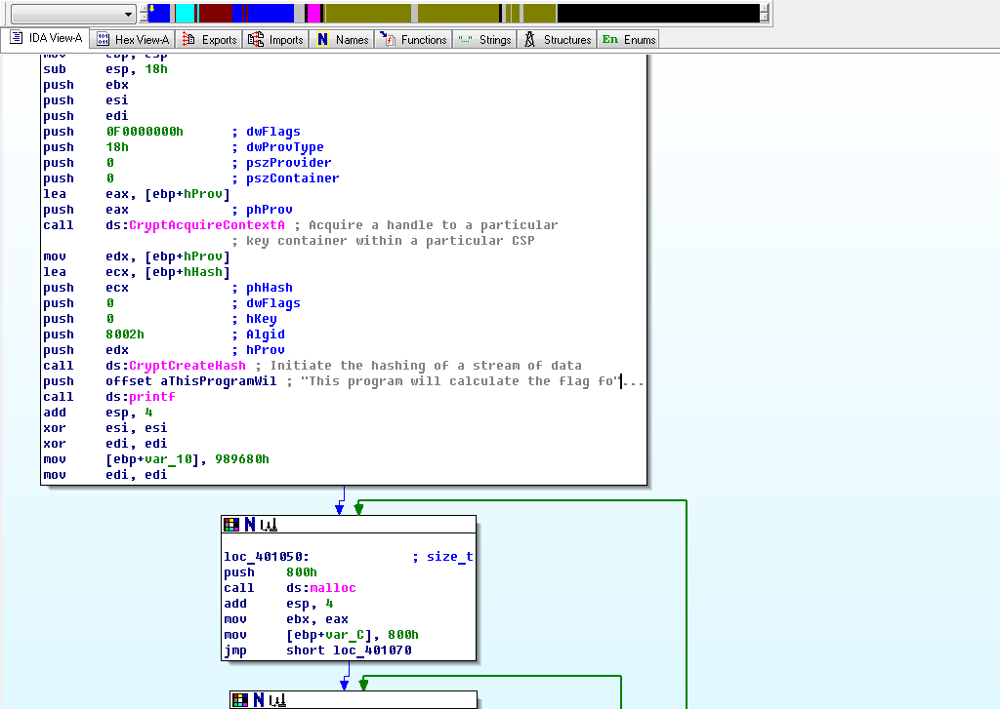
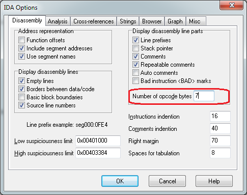
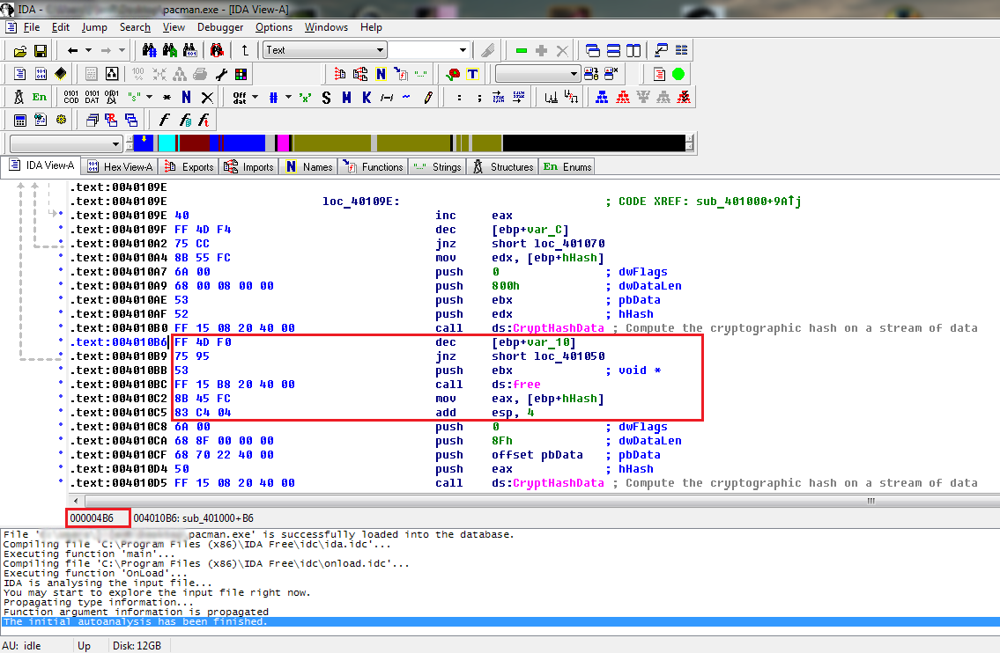
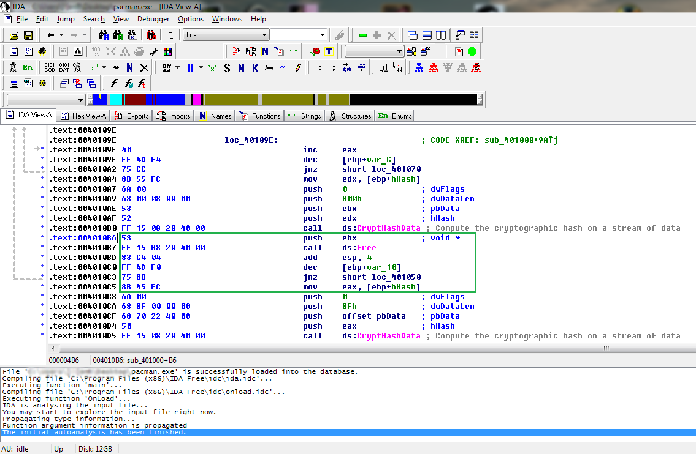
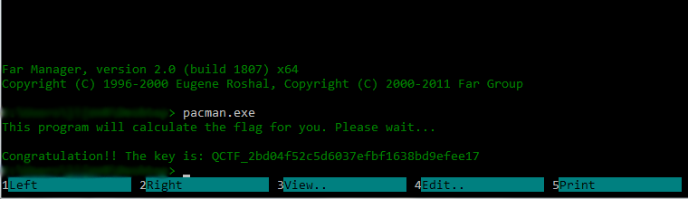

## Разбор таска pacman:
Для решения этого таска необходимо иметь представление о том, что память в программах может выделяться динамически, и что после работы с динамической памятью её необходимо освобождать. Также для решения необходимо уметь патчить программы.

Для того, чтобы начать ревёрсить программу, нам нужно иметь какую-то зацепку &mdash; место, с которого мы будем начинать исследование программы. Для её получения &mdash; запустим программу и посмотрим, что она выводит: 
 
У нас есть хорошая новость: программа посчитает для нас флаг &mdash; нам нужно лишь подождать :yum:. Но есть также и плохая: в задании говорится, что программа не работает. Через некоторое время программа "падает" :confused:: 
 
Давайте теперь запустим диспетчер задач и посмотрим на программу с точки зрения потребления ресурсов: 
 
Как мы видим, программа довольно интенсивно использует ресурсы процессора, но помимо этого очень быстро растёт количество используемой программой памяти. Это нехорошо. Это значит, что где-то в программе некорректно используется динамическая память, и в результате происходят её утечки.

Откроем программу в дизассемблере `IDA`. Перейдём к списку строк (*Shift+F12*) и поищем текст, который выводит программа: 
 
Кликнув по строке 2 раза, мы попадём в ту часть программы, в которой она хранится. Но нас интересует место использования. Для того, чтобы в него попасть, нужно перейти по ссылке, расположенной рядом со строкой: 

Большинство скомпилированных программ написано на `C/C++`, эта &mdash; не исключение. За выделение памяти в языке `C` отвечает функция `malloc`. Функция принимает один параметр &mdash; количество байт памяти, которое необходимо выделить, &mdash; и возвращает адрес выделенного блока памяти. 
Эта функция используется в программе чуть ниже: 
 
**Обратите внимание:** функция вызывается в цикле! На это указывает стрелка, идущая откуда-то снизу. 
**Обратите внимание на команду `add esp, 4`:** она тоже относится к вызову функции `malloc`! 
В `ассемблере` (язык, который вы сейчас видите) параметры передаются функциям командой `push`, а значение, возвращаемое функцией, помещается в регистр (переменную процессора) `eax`. Таким образом, функции `malloc` передаётся значение `800h` (2048), а после вызова функции адрес выделенного блока памяти копируется в регистр `ebx`.

Для освобождения памяти, выделенной функцией `malloc`, используется функция `free`. Она также принимает единственный параметр &mdash; адрес выделенного участка памяти, который нужно освободить. 
Давайте перейдём в конец того цикла, в котором мы видели выделение памяти. 
 
Как вы можете видеть, нигде в пределах цикла память не освобождается. Следовательно, именно в этом месте происходит утечка! 
Сразу же после цикла вызывается функция освобождения памяти, которой в качестве параметра передаётся регистр `ebx` (тот самый, в который после выделения памяти копировался адрес). **Таким образом, для восстановления работоспособности программы необходимо внести освобождение памяти в цикл!!** 
**Обратите внимание:** Помните про команду `add esp, 4`? Она присутствует после функции `free`, и её тоже необходимо внести в цикл!

Теперь, когда мы знаем, что нужно делать, нам понадобится любой шестнадцатеричный редактор (я воспользуюсь плагином `Hexitor` для файлового менеджера `Far`). Но перед этим нам нужно узнать, какие байты соответствуют каждой команде. Для этого в дизассемблере `IDA` выберем пункт меню *Options -> General...*: 
 
... и в появившемся окне в поле `Number of opcode bytes` напишем какое-нибудь маленькое число, например, `7`: 
 
Теперь перейдём к текстовому виду (клавиша `Space` a.k.a. пробел): 
 
Обратите внимание на выделенные команды. Команды в строках `1 и 2` отвечают за переход к началу цикла, а в строках `3, 4 и 6` &mdash; за освобождение памяти. Таким образом, в результате правки программы у нас должно получить что-то вроде этого: 

Поставим курсор в первую строчку блока и посмотрим в левый нижний угол окна. Там отображается смещение команды относительно начала файла (в шестнадцатеричном виде). Первая команда блока находится по смещению `0x4B6`. 
Теперь мы готовы приступить к редактированию. Откроем нашу программу в шестнадцатеричном редакторе и перейдём по указанному смещению (*Ctrl+G*): 
 
Нам необходимо поменять порядок следующих байт: 
 
Сначала передаём функции `free` адрес памяти, который нужно освободить: байт `53`. 
После этого вызываем функцию `free`: байты `FF 15 B8 20 40 00` и `83 C4 04`. 
Затем уменьшаем значение счётчика цикла: байты `FF 4D F0`. 
Теперь нам нужно перейти к началу цикла, но просто переписать имеющиеся 2 байта мы не можем в силу устройства команды перехода. Первая часть команды &mdash; байт `75` &mdash; определяет саму команду &mdash; `jnz`, а вторая часть &mdash; байт `95` &mdash; определяет смещение (отрицательное!!), по которому необходимо перейти после выполнения текущей команды. Поскольку мы внесли в цикл дополнительные 10 байт, нам нужно уменьшить это смещение (т.к. смещение &mdash; это отрицательное число) на 10 = 0Ah. `95h - 0Ah = 8Bh`. Таким образом, переход к началу цикла будет осуществлять следующая последовательность байт: `75 8B`. 
Последнее, что нам нужно сделать &mdash; это вернуть команду, стоявшую перед `add esp, 4`, на место. Её байты: `8B 45 FC`. 
В результате должно получиться так: 

Сохраняем изменения и запускаем: 
